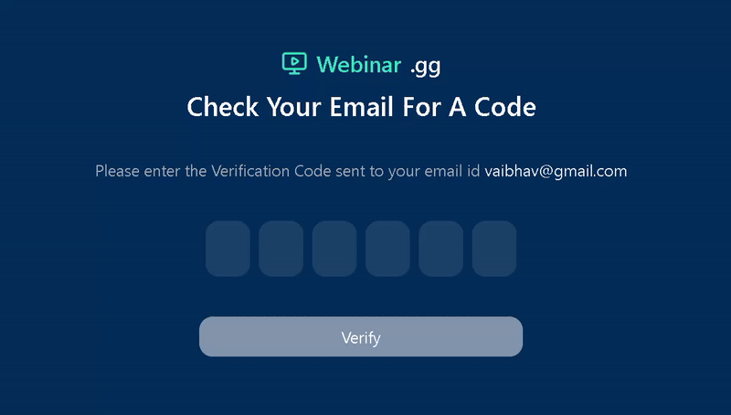

# Tailwind CSS with React

This project is a simple React application that demonstrates the use of Tailwind CSS for styling components. It includes an OTP (One Time Password) input component that allows users to enter a verification code.

## Features

- Responsive design using Tailwind CSS
- Simple and clean UI

## Technologies Used

- **React**: A JavaScript library for building user interfaces
- **Tailwind CSS**: A utility-first CSS framework for styling
- **Vite**: A build tool that provides a fast development environment
- **ESLint**: A tool for identifying and fixing problems in JavaScript code

# Tailwind CSS Classes Used in the Project

| Category               | Classes                                                                                     |
|-----------------------|---------------------------------------------------------------------------------------------|
| **Flexbox Classes**    | `flex`, `flex-col`, `justify-center`, `justify-between`, `items-center`, `space-y-2`, `space-y-8`, `space-x-2` |
| **Grid Classes**       | `grid`, `grid-cols-12`, `col-span-4`, `col-span-6`, `col-span-2`, `sm:grid-cols-12`    |
| **Background Color Classes** | `bg-blue-300`, `bg-red-300`, `bg-green-300`, `bg-yellow-300`, `bg-blue-500`, `bg-blue-700`, `bg-green-400`, `bg-blue-200` |
| **Text Color Classes** | `text-white`, `text-gray-400`, `text-gray-200`, `text-teal-400`, `text-xl`, `text-2xl`, `text-sm`, `text-lg` |
| **Font Classes**       | `font-medium`, `font-semibold`                                                             |
| **Sizing Classes**     | `h-screen`, `w-[40px]`, `h-[50px]`, `px-4`, `px-32`, `py-2`, `text-7xl`                   |
| **Border Radius Classes** | `rounded-full`, `rounded-xl`                                                             |
| **Margin and Padding Classes** | `m-1`, `p-2`, `space-y-8`                                                             |
| **Outline and Ring Classes** | `outline-none`, `focus:outline-none`, `focus:ring-2`, `focus:ring-green-400`          |
| **Responsive Classes**  | `sm:col-span-4`, `sm:col-span-6`, `sm:col-span-2`, `xl:bg-yellow-300`, `md:bg-green-300`, `sm:bg-blue-300` |

